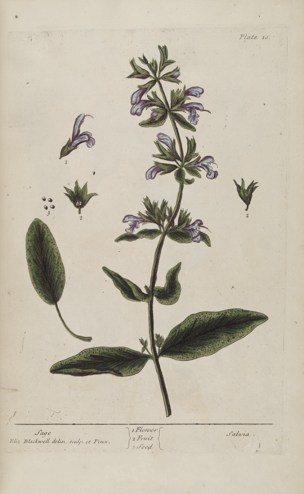
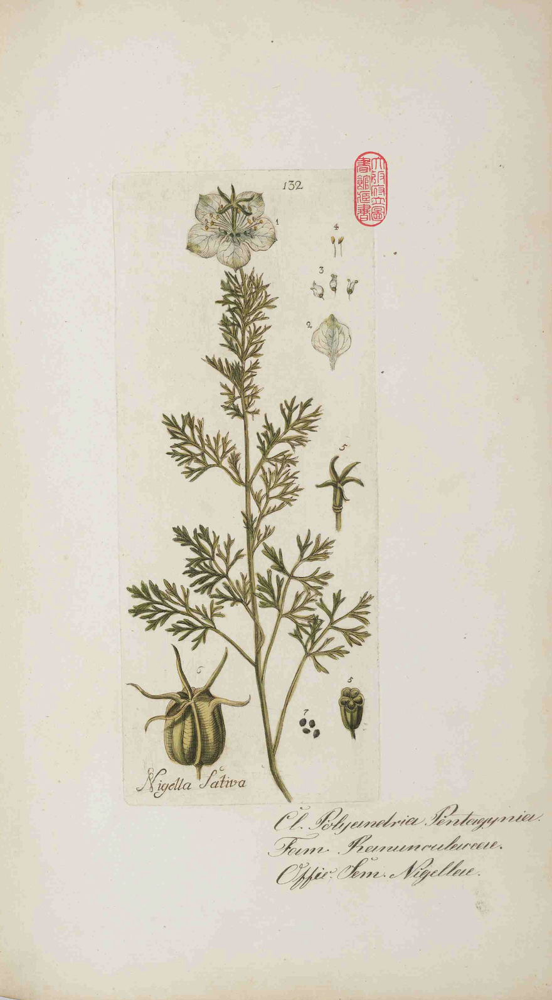
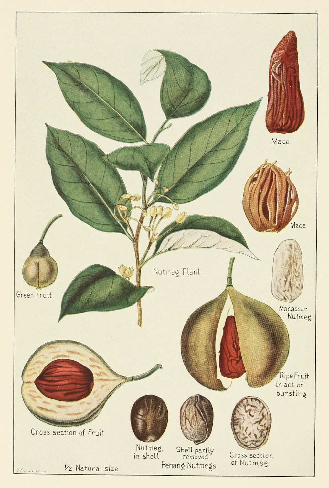
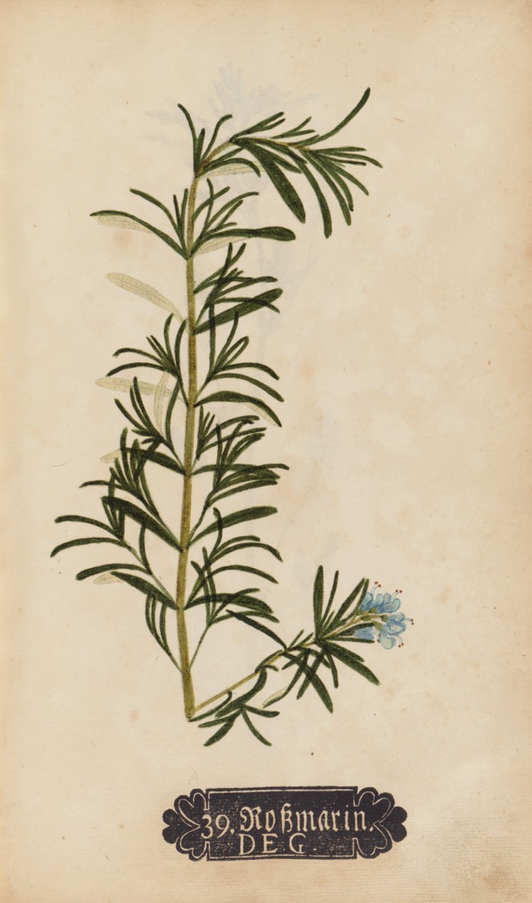
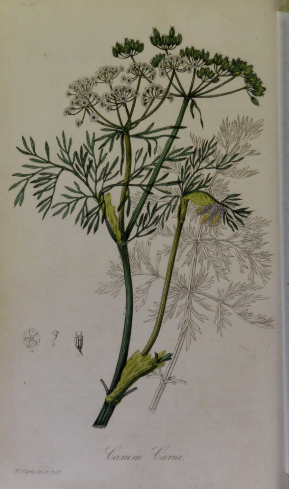

  

# Spices

This repo contains information I used to build a spice rack.

## Labels

In order to create the spice labels, I used images from botanical books that are in the public domain. You can find the sources below.

I processed each PDF using Adobe Acrobat's OCR, to make finding the right plant easier.

The images are cut out using Adobe Photoshop and the layout of the labels is done in Affinity Designer.

## Rack

The rack was designed in Autodesk's Fusion 360, and fits IKEA's Rajtan jars.

## Sources

Some of these books were easily found on archive.org, but some were really hard to find. I did my best to use only images that are in the public domain, if you have any concerns about it open an issue or send me an email.

They are roughly ranked from most-used to least-used.

### Köhler's Medizinal-Pflanzen (1887-1898)

by Hermann Adolph Köhler

Published in 4 "Bands" (volumes)

DJVU files found via LibGen:

[Volume 1](https://libgen.li/edition.php?id=136892691)
[Volume 2](https://libgen.li/edition.php?id=136892693)
[Volume 3](https://libgen.li/edition.php?id=136892692)
[Volume 4](https://libgen.li/edition.php?id=136892689)

### Medicinal Plants (1880)

by Robert Bentley and Henry Trimen

Published in 2 parts

[Biodiversity Heritage Library](https://www.biodiversitylibrary.org/bibliography/33542)

[medicinalplantsb01bentrich directory listing](https://archive.org/download/medicinalplantsb01bentrich)

[medicinalplantsb02bentrich directory listing](https://archive.org/download/medicinalplantsb02bentrich)

### A Curious Herbal (1737-1739)

by Elizabeth Blackwell

[https://web.archive.org/web/20090103122758/http://www.illustratedgarden.org/mobot/rarebooks/title.asp?relation=QK99A1B5441737V1](https://web.archive.org/web/20090103122758/http://www.illustratedgarden.org/mobot/rarebooks/title.asp?relation=QK99A1B5441737V1)

[MBG Rare Books](https://web.archive.org/web/20110814214612/http://www.illustratedgarden.org/mobot/rarebooks/taxa.asp?relation=QK99A1B5441737V1)

[https://archive.org/download/mobot31753002620836](https://archive.org/download/mobot31753002620836)

### Botanica Pharmaceutica (1788)

by A. F. Happe 

Published in 5 "centurias" (volumes)

Images were scraped from a library in Osaka, and downloaded from the Statsbibiliothek Berlin:

[Osaka Library](https://iss.ndl.go.jp/books/R000000062-I000001448-00?ar=4e1f&locale=en#)

[Volume 1](http://e-library2.gprime.jp/lib_pref_osaka/da/detail?tilcod=0000000025-00030211)
[Volume 2](http://e-library2.gprime.jp/lib_pref_osaka/da/detail?tilcod=0000000025-00030216)
[Volume 3](http://e-library2.gprime.jp/lib_pref_osaka/da/detail?tilcod=0000000025-00030214)
[Volume 4](https://digital.staatsbibliothek-berlin.de/werkansicht?PPN=PPN775691585)
[Volume 5](https://digital.staatsbibliothek-berlin.de/werkansicht/?PPN=PPN77569231X)

### Spices, their nature and growth, the vanilla bean, a talk on tea (1915)

by McCormick and company

Available on archive.org:

[Book](https://archive.org/details/spicestheirnatur00mcco/page/32/mode/2up)

### Hand-Artlas sämmtlicher medicinisch-pharmaceutischer Gewächse (1876)

by Dr. Wilibald Artus

Available in the Harvard Library:

Published in 2 "Bands" (volumes)

[Volume 1](https://publikationsserver.tu-braunschweig.de/receive/dbbs_mods_00000760)
[Volume 2](https://publikationsserver.tu-braunschweig.de/receive/dbbs_mods_00000761)

### Ausländische Culturpflanzen in bunten Wand-Tafeln (1880-1881)

by Zippel

Available on archive.org:

[Volume 1](http://archive.org/details/auslayndischekuv1zipp)
[Volume 2](http://archive.org/details/auslayndischekuv2zipp)

### Botanica in originali pharmaceutica (1733)

by Johann Hieronymus

Available in the Harvard Library:

[Book](https://iiif.lib.harvard.edu/manifests/view/drs:439022766$354i)

### Medical botany (1834)

by John Stephenson

Available in the Harvard Library:

[Book](https://iiif.lib.harvard.edu/manifests/view/drs:8210810$1i)

### Curtis's Botanical Magazine (1787-now)

by William Curtis & others

### Icones Plantarum Rariorum (1781-1793)

by Nicolaus Jacquin

### Seikei Zusetsu 成形図説 (1804)

Scans available from Leiden University:

[Leiden University](https://digitalcollections.universiteitleiden.nl/japanese_agriculture_19th_century)
[Wikimedia](https://commons.wikimedia.org/wiki/Category:Seikei_Zusetsu)

### Others

Amomum Sublatum: https://powo.science.kew.org/taxon/872166-1, commissioned by William Roxburgh who lived 1751-1815
 
Zanthoxylum Armatum: Descourtilz 1833
 
Zanthoxylum Bungeanum: L. Reeve & co London / Vincent Brooks, around 1864
 
Schinus terebinthifolia: Historia naturalis Brasiliae 1648
 

## About this project

The structure of the project is as follows. Keep in mind that the files aren't very well organized yet.

- `export`: The individual PNGs of the labels, to be printed.
- `artboards.afdesign`: Source file with all the labels (Affinity Designer file).
- `arabic-texts`: Because Affinity Designer does not support RTL text, I designed some texts with Photoshop and imported them into the labels.
- `book-screenshots`: Image captures from books I may have used. JPG/PNG is the original file, PSD is the cut-out file.
- `rack`: STL/3MF files used for printing the rack. 3MF files are likely PrusaSlicer files.
- `samples`: Image captures from books used in this readme.

## Fonts

I tried to use appropriate fonts for every used language. These are as follows:

- Main text: Renslaer
- Arabic: BM Hanna Pro
- Chemical name: Courier
- Chinese: Fontquan-XinYiJiXiangSong
- E-code: Menlo
- Devanagari: Khmer MN
- Hindi/Urdu: Laila
- Latin: League Script
- Syrian: Noto Sans Syriac