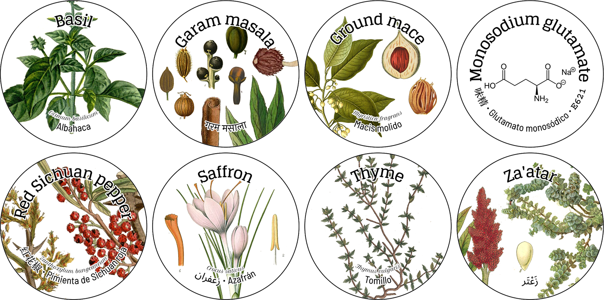

# [Spices.app](https://spices.app)

This is an open source project where I created spice labels based on old botanical books that are now in the public domain.

This is the new version of the project, where I added an app to generate the labels. You can find this app on [spices.app](https://spices.app).

You can check out the original project with all sources listed on [the v1 branch](https://github.com/hansottowirtz/spices/tree/v1). You will also find the old 3d-printable files there.